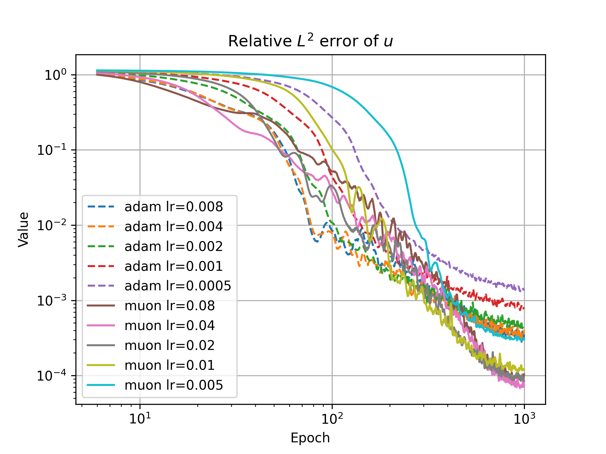

# PINNs optimizer benchmark

Here we consider a standard Kovasznay flow problem with $\mathrm{Re}=20$ on unit square. The architecture of PINNs is FLS with `Stan` activation.
To guarantee stability, exponential decay learning rate schedule is applied, and the final-lr is set to `1e-5`

To run:

```sh
pip install -r requirements.txt
sh run_exp.sh
```

> The Muon optimizer in use is a (slightly) modified verision [here](https://github.com/Adversarr/Muon)

## Major Results

Compared with Adam optimizer, the proposed [Muon](https://github.com/KellerJordan/Muon) optimizer converges obviously faster & converge to a better solution, see below.




## More Results

Adam 8e-3:


Adam 4e-3:


Adam 2e-3:


Adam 1e-3:


Adam 5e-4:


Muon 8e-2:


Muon 4e-2:


Muon 2e-2:


Muon 1e-2:


Muon 5e-3:

